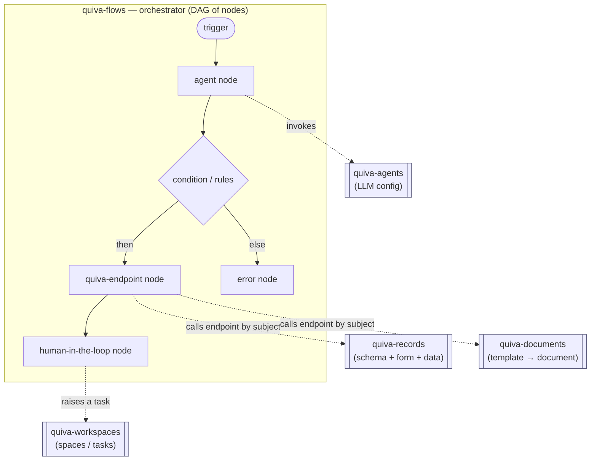

# Quiva MCPs — How the Five Fit Together

A mental model of the five Quiva MCP servers, how they relate, and how to test
them in the UI. Companion to the per-MCP playbooks
([agents], [documents], [flows], [records], workspaces) in this folder.

[agents]: ./quiva-flows-mcp-playbook.md
[documents]: ./quiva-documents-mcp-playbook.md
[flows]: ./quiva-flows-mcp-playbook.md
[records]: ./quiva-records-mcp-playbook.md

## The big picture: one platform, five config surfaces

All five MCPs talk to the **same Quiva / Microstrate platform** — one API
gateway (`api.microstrate.io` staging, `api.quiva.ai` production) fronting ~20
microservices and 468 endpoints. Each MCP wraps the **config surface of one
service**: you use the MCP to author a config, and that config then appears and
runs in the corresponding area of the Quiva UI.

| MCP | Backend service | What you author | UI area to verify |
|---|---|---|---|
| **quiva-agents** | hub-service (agent) | LLM configs (behaviour, model, tools, knowledge) | Agents |
| **quiva-flows** | hub-service (workflow) | Workflows = DAG of nodes | Workflows / flow editor |
| **quiva-records** | records-service | Schema + form UI (+ data rows) | Records / forms |
| **quiva-documents** | file-generator | DOCX templates → generated docs + e-sign | Documents / templates |
| **quiva-workspaces** | workspaces-service | Spaces, tasks, comments | Workspaces / boards |

## Flows is the spine — it orchestrates the other four

The other four MCPs produce **standalone building blocks**. **Flows is the
orchestrator** that wires them into a process. A flow is a directed **acyclic**
graph of **nodes**, and the node types are exactly where the other domains plug
in.



### The node types and what they tie to

| Node type | Does / ties to |
|---|---|
| `agent` | Invokes an **agent** — inline definition *or* a saved agent `subject` → **quiva-agents** |
| `quiva-endpoint` | Calls **any** Quiva service endpoint by subject → **records / documents / workspaces / accounts / storage …** (the universal glue; use `list_quiva_endpoints`) |
| `function` | Invokes a compute (Hydra) function (`ms.compute.*`) |
| `http` / `integration` | External API (Slack, GitHub, …); `integration` adds OAuth metadata |
| `condition` / `rules` | Branch via the rules engine (see below) |
| `input` / `human-in-the-loop` | Pauses the run for human input / assignment (≈ **workspaces** task) |
| `eval` / `map` / `static` | Data plumbing (JS eval, reshape, literals) |
| `delay` / `schedule` | Timing (pause; schedule a later run) |
| `flow` | Runs a sub-workflow by subject |
| `error` | Terminate the flow with a status code |
| `trigger` | Editor metadata; skipped at runtime |

There are **two glue mechanisms**:

1. **`agent` node** — first-class integration with the agents domain.
2. **`quiva-endpoint` node** — generic: reach records / documents / workspaces
   (and every other service) by endpoint subject, without a dedicated node type.

## Shared concepts across all five

Learn these once and every MCP becomes predictable.

- **Subjects** — everything is identified by a dotted `subject`. Consistent
  scheme: agents `ms.hub.config.agent.<uuid>`, workflows
  `ms.hub.config.workflow.{draft|published}.<collection>.<flow>`, collections
  `ms.hub.config.collection.workflow.<name>`. Subjects are how services
  cross-reference each other.
- **Draft → Published lifecycle** — **flows** and **documents** both have it:
  writes go to a *draft*; you must **publish** before it runs / generates.
  Records, agents, and workspaces are live-on-write.
- **JSONPath data plane (flows)** — nodes reference data with `$.trigger`,
  `$.static`, `$.context`, `$.env.*`, and `$.<NODE_ID>` /
  `$.<NODE_ID>.result` (an agent node's answer).
- **The rules engine** — `condition` / `rules` nodes use Evari **rule-engine v2**:
  the payload is an array of `{ condition: { operator, input }, outcome }`
  branches, where `outcome` names a node ID or the reserved `RESOLVE_SUCCESS` /
  `RESOLVE_ERROR`. A branch with no `condition` is the catch-all (the editor
  renders it as `ELSE`).
  ```json
  [{ "condition": { "operator": "=", "input": ["$.TRIGGER.state", "VIC"] }, "outcome": "VIC_PATH" },
   { "outcome": "REQUEST_MORE_INFO" }]
  ```
  ⚠️ `{ if, then, else }` is **not** a real shape — it was an MCP invention that
  fails live with `value has to be a string or an array of strings`, and zero of
  the 27 live condition nodes ever used it (docs/lessons.md).
  **This is the flows *branching* syntax.** Two other things look like it and are
  not: records *forms* use json-logic form-rules, and documents
  `sub_templates[].conditions` uses rule-engine v2 in a *single-expression*
  form (`{ operator, input }` with no `outcome` wrapper). Do not conflate the three.
- **`validate_*` before write** — every MCP ships a local validator
  (`validate_flow_config`, `validate_record_config`, …). Lint locally → create →
  verify in UI.

### Gotchas worth remembering (flows)

- Agent nodes: nest the definition under `payload.agent`; a flat payload is
  silently dropped. Only `llm_provider` `"claude"`/`"anthropic"` is accepted.
- An agent's `$.<ID>.result` is a JSON-**encoded string** even with an
  `output_schema` — `JSON.parse` it in an `eval` node before branching on fields.
- Delay node type is `delay`, not `wait` (a `wait` node is a silent no-op).
- HTTP/integration payloads use `base_url` (snake_case); `baseURL` is ignored.
- The graph must be acyclic — the server does **not** detect cycles; cyclic
  nodes simply never run.

## How to test them in the UI via MCP

The loop for each MCP is the same:

> **author via MCP → (publish if applicable) → open the matching UI area →
> confirm it rendered / ran as a valid config.**

The full cross-service test is written up in
[quiva-mcp-e2e-test.md](./quiva-mcp-e2e-test.md), with a ready-to-run flow config
in [quiva-mcp-e2e-test-flow.json](./quiva-mcp-e2e-test-flow.json).
